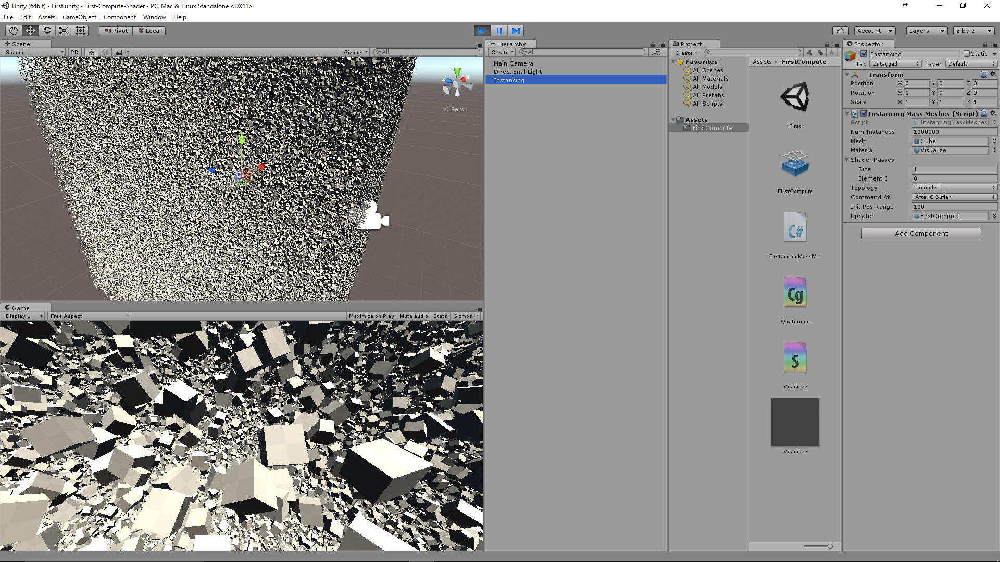

# First Compute Shader

##概要
ComputeShaderの入門

ComputeShaderとComputeBufferの使い方を勉強したー  
たくさんのメッシュをインスタンス描写したり、動かしたり

100万個のCubeを描写、落下する。(60fps@GTX970M)

##参考にしたリポジトリ
以下の先生方のリポジトリを参考に、Compute、はじめました！

- [GPUTrail (fuqunagaさん)](https://github.com/fuqunaga/GPUTrail)
- [InstancingExample (nobnakさん)](https://github.com/nobnak/InstancingExampleUnity)
- [BatchRenderer (i-saintさん)](https://github.com/i-saint/BatchRenderer)
